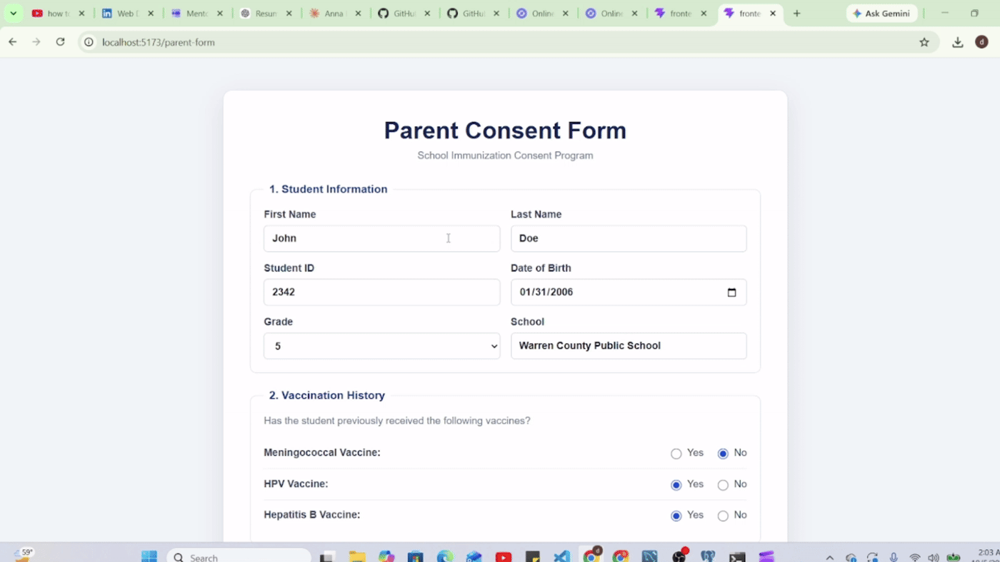

# School Immunization Consent Program (SIP)

<p align="center">
  
  
  
  
  
  
  
  
</p>

A full-stack web app that digitizes school vaccination consent. Parents submit an online consent form for their child, and public health nurses review submissions, view student details, and record vaccine assessments from a secure dashboard.



---

## Features

**Parent / Guardian**

- Online consent form with student information, vaccination history, and health history
- Per-vaccine consent or decline for Meningococcal, HPV, and Hepatitis B
- Parent/guardian details, signature, and accuracy confirmation
- Clear success and error feedback on submission

**Nurse Portal**

- Email and password login
- Dashboard with summary stats (total consents, submitted, pending, assessed today)
- Searchable list of consent records
- Detailed student view: student info, vaccine history, health history, consent decisions, and parent declaration
- Clinic assessment form to record the vaccine administered, date, dose number, and notes
- Manual entry for records that did not come through the online form

---

## Tech Stack

| Layer    | Technology                                      |
| -------- | ----------------------------------------------- |
| Frontend | React, Vite, React Router, Axios, CSS           |
| Backend  | Node.js, Express                                |
| Database | MySQL (via a`mysql2`-style `db.query` pool) |

---

## Getting Started

### Prerequisites

- Node.js 18+
- MySQL 8+

### 1. Clone the repository

```bash
git clone <your-repo-url>
cd <your-repo-folder>
```

### 2. Set up the database

Create a MySQL database and the tables the API expects:

| Table                | Purpose                                                                     |
| -------------------- | --------------------------------------------------------------------------- |
| `nurses`           | Nurse accounts (`id`, `name`, `email`, `password`)                  |
| `students`         | Student records (unique`student_id`)                                      |
| `consents`         | One row per submitted consent form                                          |
| `vaccines`         | Vaccine list (1 = Meningococcal, 2 = HPV, 3 = Hepatitis B)                  |
| `consent_vaccines` | Consent/decline decision per vaccine for each consent                       |
| `assessments`      | Clinic assessments (`student_id`, `status`, `notes`, `assessed_at`) |

Then point `config/db.js` at your database (host, user, password, database name).

### 3. Start the backend

```bash
cd server
npm install
node server.js
```

The API runs on `http://localhost:3000`.

### 4. Start the frontend

```bash
cd client
npm install
npm run dev
```

The app runs on `http://localhost:5173`.

---

## API Endpoints

| Method | Endpoint             | Description                                                           |
| ------ | -------------------- | --------------------------------------------------------------------- |
| GET    | `/`                | Health check                                                          |
| POST   | `/login`           | Nurse login (`email`, `password`)                                 |
| POST   | `/api/consents`    | Submit a parent consent form                                          |
| GET    | `/api/consents`    | List all consents with vaccine decisions and latest assessment status |
| POST   | `/api/assessments` | Save a clinic assessment for a student                                |

---

## How It Works

1. A parent fills out the consent form, which is sent to `POST /api/consents`.
2. The server saves the student (skipping duplicates by student ID), the consent, and each vaccine decision.
3. A nurse signs in and the dashboard loads all records from `GET /api/consents`.
4. The nurse opens a student to review details or records an assessment, which is saved through `POST /api/assessments`.
